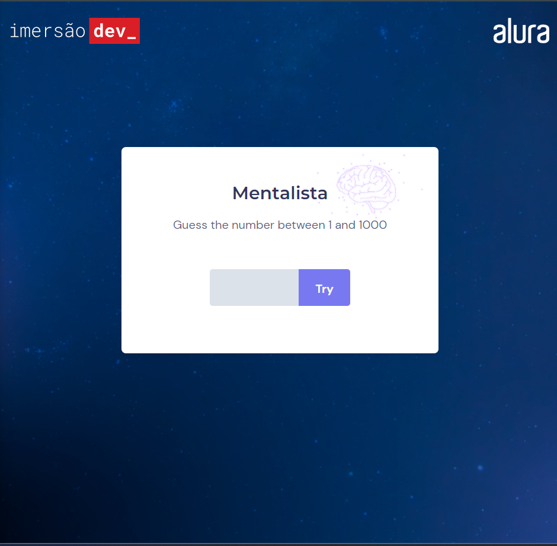

<h1 align="center"> 
  
  Mentalist
</h1>

Alura's Challenge.

  A guessing game from 1 to 1000. It will give you hints if it is smaller or larger.  

  <a href="#-technologies">Technologies</a>&nbsp;&nbsp;&nbsp;|&nbsp;&nbsp;&nbsp;
  <a href="#-project">Project</a>&nbsp;&nbsp;&nbsp;|&nbsp;&nbsp;&nbsp;
  <a href="#memo-licença">License</a>

  

 

## 🚀 Technologies

This project was developed with the following technologies:

- HTML e CSS
- JavaScript

## 💻 Project

- [Visit the project online](https://arks-lacerda.github.io/04-everydayHabitsExplorer/)

## 📝 License

This project is licensed under the MIT license.

---

Done with ♥ by Arthur 👋
